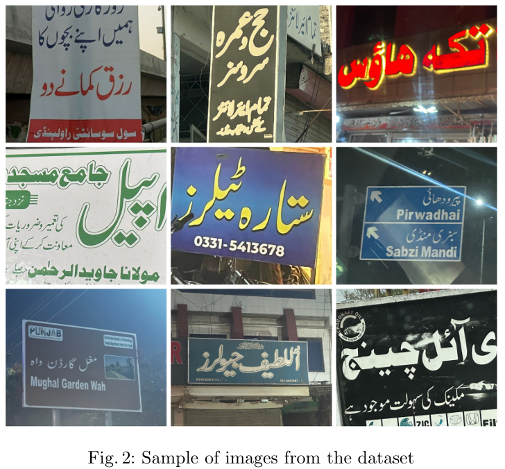

# Dataset and Benchmark for Urdu Natural Scenes Text Detection, Recognition and Visual Question Answering

Accepted by ICDAR 2024

The link of our paper: https://arxiv.org/pdf/2405.12533

Researchers and developers can download the dataset, including the full images, cropped word images, and annotations, from our official repository.

The download link is as follows:
	
Baidu Netdisk Link：https://pan.baidu.com/s/1Z8Aab9ETKkbPcMZjZ8bL9A 
Extraction code：urdu 

Google drive: https://drive.google.com/file/d/10gjtRlQDyo_pNah7rgy87y4_BkGsmCuB/view?usp=drive_link

